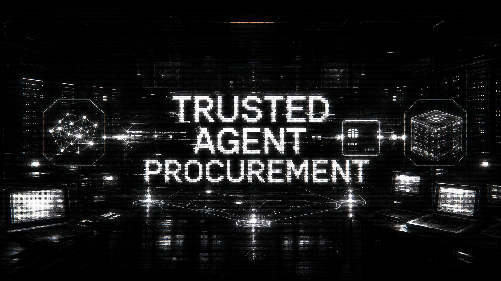

# Trusted Agent Procurement



Autonomous procurement for business agents.

Trusted Agent Procurement lets an AI buyer agent prove identity, verify spend authority, negotiate GPU capacity, trigger a Stripe-style payment, and receive provisioning with an audit trail.

The demo uses a CloudForge GPU provider front desk and a Nexus buyer agent. The buyer presents a signed `AgentPassport`, CloudForge checks capabilities and budget, then completes the procurement flow.

For judges: start with [Hackathon Submission](HACKATHON_SUBMISSION.md), then run `make smoke`.

## Demo Video

[](docs/assets/demo-mono.mp4)

[Watch the full MP4 demo](docs/assets/demo-mono.mp4).

## Why It Matters

Agents that run real operations need to buy software, infrastructure, data, and services. API keys are not enough for that world. Vendors need to know:

- Which agent is calling?
- Who authorized it?
- What is it allowed to buy?
- What is its spend limit?
- Which payment and provisioning event happened?

This repo implements the smallest complete loop: identity, delegated authority, budget control, payment, provisioning, and auditability.

## Demo Story

1. Nexus Buyer Agent presents an Ed25519-signed `AgentPassport`.
2. CloudForge Trusted Procurement Desk verifies the DID-backed passport.
3. The desk checks capabilities: `purchase:gpu`, `vendor:cloudforge`, `contract:sign`, `budget:5000`.
4. The buyer asks for `8x H100` GPUs for a 72-hour fine-tuning run.
5. CloudForge returns a quote within budget.
6. A Stripe-compatible test provider records payment.
7. CloudForge provisions a GPU resource and returns onboarding details.
8. The audit log summarizes the autonomous business transaction.

## Quickstart

```bash
uv sync --extra dev
uv run trusted-agent-demo --fast
```

Judge smoke test:

```bash
make smoke
```

## Architecture

```text
Buyer Agent
  |
  | AgentPassport + procurement request
  v
CloudForge Trusted Procurement Desk
  |-- agentid_verify: Ed25519 DID/JWT verification
  |-- capability gate: purchase/vendor/contract authority
  |-- budget gate: budget:<amount>
  |-- runtime provider: local planner, Nemotron 3 Ultra adapter placeholder
  |-- safety provider: local gate, NemoClaw adapter placeholder
  |-- quote engine: GPU catalog and volume pricing
  |-- payment boundary: MockStripeProvider, StripeProvider, Hermes Stripe Skills placeholder
  |-- provisioning provider: deterministic CloudForge receipt
  |-- skills provider: local registry, NVIDIA agent skills placeholder
  |-- audit log: identity, plan, safety, quote, payment, provisioning events
```

## Integration Readiness

The demo is honest by default: it runs without external credentials and does not claim live NVIDIA, Hermes, or Stripe production integration.

Currently live in this repo:

- `agentid_verify` validates signed demo `AgentPassport` tokens.
- `LocalRuntimeProvider` creates a deterministic procurement plan.
- `LocalSafetyProvider` enforces a small local policy gate before payment.
- `StaticAgentSkillsProvider` advertises the local A2A-style skills.
- `MockStripeProvider` returns Stripe-shaped test payment receipts.
- `MockCloudForgeProvisioningProvider` returns deterministic onboarding records.

Adapter surfaces ready for real hackathon wiring:

- `StripeProvider`: creates real Stripe PaymentIntents after installing `stripe` and passing `STRIPE_SECRET_KEY`.
- `HermesStripeSkillsProvider`: placeholder for Hermes Stripe Skills payment/provisioning. Expected env: `HERMES_STRIPE_SKILLS_ENDPOINT`, `HERMES_STRIPE_SKILLS_API_KEY`.
- `Nemotron3UltraPlanner`: placeholder for NVIDIA Nemotron 3 Ultra planning/model runtime. Expected env: `NVIDIA_NEMOTRON_ENDPOINT`, `NVIDIA_API_KEY`, optional `NVIDIA_NEMOTRON_MODEL`.
- `NemoClawSafetyProvider`: placeholder for NVIDIA NemoClaw policy/safety gating. Expected env: `NVIDIA_NEMOCLAW_ENDPOINT`, `NVIDIA_API_KEY`, `NVIDIA_NEMOCLAW_POLICY_ID`.
- `NvidiaAgentSkillsProvider`: placeholder for an external NVIDIA agent skills registry. Expected env: `NVIDIA_AGENT_SKILLS_ENDPOINT`, `NVIDIA_API_KEY`.

The placeholder adapters intentionally raise until their real SDK or HTTP contracts are wired.

## Run Locally

```bash
uv sync --extra dev
uv run trusted-agent-server
```

Agent card:

```bash
curl http://127.0.0.1:9998/.well-known/agent-card.json
```

JSON-RPC client:

```bash
uv run python examples/jsonrpc_client.py
```

## Test

```bash
PYTEST_DISABLE_PLUGIN_AUTOLOAD=1 uv run pytest
```

Or run the full smoke check:

```bash
make smoke
```

## API

Endpoints:

- `GET /health`
- `GET /.well-known/agent-card.json`
- `POST /` with JSON-RPC method `procurement/procure`
- `POST /procure` with `Authorization: AgentPassport <jwt>`

## Repository Layout

```text
src/agentid_verify/                 # Local Python verifier adapted from agentid
src/trusted_agent_procurement/      # CloudForge desk, demo, server, payments
tests/                              # Identity, procurement, and server coverage
examples/jsonrpc_client.py          # Minimal A2A-style JSON-RPC client
docs/assets/demo-mono.mp4           # Demo video
docs/assets/demo-preview-mono.gif   # Animated README preview
docs/architecture.md                # Technical architecture notes
docs/demo-script.md                 # 1-3 minute video recording script
.github/workflows/ci.yml            # Test and demo smoke workflow
```

## Design Notes

- `MockStripeProvider` returns Stripe-shaped test payment records without requiring credentials.
- `StripeProvider` is the upgrade path for real PaymentIntents.
- `integrations.py` defines runtime, safety, skills, and provisioning provider boundaries.
- NVIDIA and Hermes adapters are explicit placeholders until their exact APIs are connected.
- `agentid_verify` is adapted from the `agentid` passport verifier.
- The CloudForge procurement desk follows the A2A front desk pattern.

## Docs

- [Architecture notes](docs/architecture.md)
- [Video demo script](docs/demo-script.md)
